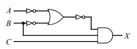
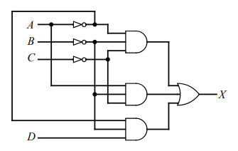
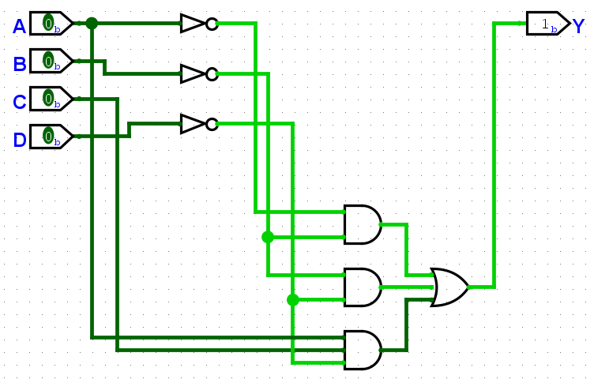

# Lista de Projeto 01 - Circuitos Digitais
Projeto direcionado à disciplina de Circuitos Digitais, ministrada pelo Prof Dr Pedro Thiago Valério de Souza no período 2025.2, na Universidade Federal Rural do Semi-Árido (UFERSA).

# Autores 
- Ana Beatriz Almeida da Silva | [Ana Beatriz Almeida](https://github.com/biiaalmeida) 
- Nome de Thiago | [Thiago Emanoel Evaristo Barroso Dantas](https://github.com/evaristoT)

# Sumário

- [Problema 01](#problema-01)
- [Problema 02](#problema-02)
- [Problema 03](#problema-03)
- [Problema 04](#problema-04)
- [Problema 05](#problema-05)

# Problema 01 
Implemente os seguintes circuitos com as expressões lógicas de saída dadas em Logisim, obtendo, como resposta, a tabela da verdade de cada circuito:  
## a) x = A'B + C

| A | B | C | x |
|:-:|:-:|:-:|:-:|
| 0 | 0 | 0 | 0 |
| 0 | 0 | 1 | 1 |
| 0 | 1 | 0 | 1 |
| 0 | 1 | 1 | 1 |
| 1 | 0 | 0 | 0 |
| 1 | 0 | 1 | 1 |
| 1 | 1 | 0 | 0 |
| 1 | 1 | 1 | 1 |

## b) S = (A + B)(B + C')

| A | B | C | S |
|:-:|:-:|:-:|:-:|
| 0 | 0 | 0 | 0 |
| 0 | 0 | 1 | 0 |
| 0 | 1 | 0 | 1 |
| 0 | 1 | 1 | 1 |
| 1 | 0 | 0 | 1 |
| 1 | 0 | 1 | 0 |
| 1 | 1 | 0 | 1 |
| 1 | 1 | 1 | 1 |

## c) x = ~(A B (C + D))

| A | B | C | D | x |
|:-:|:-:|:-:|:-:|:-:|
| 0 | 0 | 0 | 0 | 1 |
| 0 | 0 | 0 | 1 | 1 |
| 0 | 0 | 1 | 0 | 1 |
| 0 | 0 | 1 | 1 | 1 |
| 0 | 1 | 0 | 0 | 1 |
| 0 | 1 | 0 | 1 | 1 |
| 0 | 1 | 1 | 0 | 1 |
| 0 | 1 | 1 | 1 | 1 |
| 1 | 0 | 0 | 0 | 1 |
| 1 | 0 | 0 | 1 | 1 |
| 1 | 0 | 1 | 0 | 1 |
| 1 | 0 | 1 | 1 | 1 |
| 1 | 1 | 0 | 0 | 1 |
| 1 | 1 | 0 | 1 | 0 |
| 1 | 1 | 1 | 0 | 0 |
| 1 | 1 | 1 | 1 | 0 |

## d) x = A ⊕ B ⊕ C

| A | B | C | x |
|:-:|:-:|:-:|:-:|
| 0 | 0 | 0 | 0 |
| 0 | 0 | 1 | 1 |
| 0 | 1 | 0 | 1 |
| 0 | 1 | 1 | 0 |
| 1 | 0 | 0 | 1 |
| 1 | 0 | 1 | 0 |
| 1 | 1 | 0 | 0 |
| 1 | 1 | 1 | 1 |

## d) y = AB + BC + AC

| A | B | C | y |
|:-:|:-:|:-:|:-:|
| 0 | 0 | 0 | 0 |
| 0 | 0 | 1 | 0 |
| 0 | 1 | 0 | 0 |
| 0 | 1 | 1 | 1 |
| 1 | 0 | 0 | 0 |
| 1 | 0 | 1 | 1 |
| 1 | 1 | 0 | 1 |
| 1 | 1 | 1 | 1 |

# Problema 02
Implemente os seguintes circuitos em Logisim, obtendo, como resposta, a expressão lógica simplificada e a tabela da verdade de cada circuito:  

## a) Circuito A
Circuito dado:  

Expressão Lógica Simplificada: ABC  
Tabela verdade: 

| A | B | C | x |
|:-:|:-:|:-:|:-:|
| 0 | 0 | 0 | 0 |
| 0 | 0 | 1 | 0 |
| 0 | 1 | 0 | 0 |
| 0 | 1 | 1 | 0 |
| 1 | 0 | 0 | 0 |
| 1 | 0 | 1 | 0 |
| 1 | 1 | 0 | 0 |
| 1 | 1 | 1 | 1 |

## b) Circuito B

Circuito dado:  

Expressão Lógica Simplificada: B'C' + A'B'C  
Tabela verdade: 

| A | B | C | D | x |
|:-:|:-:|:-:|:-:|:-:|
| 0 | 0 | 0 | 0 | 1 |
| 0 | 0 | 0 | 1 | 1 |
| 0 | 0 | 1 | 0 | 0 |
| 0 | 0 | 1 | 1 | 1 |
| 0 | 1 | 0 | 0 | 0 |
| 0 | 1 | 0 | 1 | 0 |
| 0 | 1 | 1 | 0 | 0 |
| 0 | 1 | 1 | 1 | 0 |
| 1 | 0 | 0 | 0 | 1 |
| 1 | 0 | 0 | 1 | 1 |
| 1 | 0 | 1 | 0 | 0 |
| 1 | 0 | 1 | 1 | 0 |
| 1 | 1 | 0 | 0 | 0 |
| 1 | 1 | 0 | 1 | 0 |
| 1 | 1 | 1 | 0 | 0 |
| 1 | 1 | 1 | 1 | 0 |

# Problema 03
Considere um circuito com tabela verdade apresentada abaixo. Utilizando o Logisim, obtenha a
expressão lógica simplificada para a saída Y e o diagrama de circuito correspondente.  

A questão nos dá a seguinte tabela da verdade:  
| A | B | C | D | Y |
|:-:|:-:|:-:|:-:|:-:|
| 0 | 0 | 0 | 0 | 1 |
| 0 | 0 | 0 | 1 | 1 |
| 0 | 0 | 1 | 0 | 1 |
| 0 | 0 | 1 | 1 | 1 |
| 0 | 1 | 0 | 0 | 0 |
| 0 | 1 | 0 | 1 | 0 |
| 0 | 1 | 1 | 0 | 0 |
| 0 | 1 | 1 | 1 | 0 |
| 1 | 0 | 0 | 0 | 1 |
| 1 | 0 | 0 | 1 | 0 |
| 1 | 0 | 1 | 0 | 1 |
| 1 | 0 | 1 | 1 | 0 |
| 1 | 1 | 0 | 0 | 0 |
| 1 | 1 | 0 | 1 | 0 |
| 1 | 1 | 1 | 0 | 1 |
| 1 | 1 | 1 | 1 | 0 |

Expressão simplificada: 'A⋅B'+B'⋅D'+A⋅C⋅D'  
Diagrama de circuito correspondente:  

# Problema 04

Um sistema de ar condicionado deverá atuar sob as seguintes premissas:

1.  Temperatura acima de 21°C **E** estar entre 9:00h e 17:00h, **OU**
2.  Ser final de semana **E** com umidade relativa do ar acima de 85%, **OU**
3.  Umidade relativa do ar acima de 85% **E** temperatura acima de 21°C **E** ser final de semana, **OU**
4.  Umidade relativa do ar acima de 85% **E** temperatura acima de 21°C **E** estar entre 9:00h e 17:00h.

Caso contrário, o sistema de ar condicionado deverá permanecer desligado.
## Variáveis de Entrada

Foram definidas as seguintes variáveis de entrada:

| Variável | Descrição | Complemento |
| :---: | :--- | :--- |
| **H** | Estar entre 9:00h e 17:00h | **H'** Não estar entre 9:00h e 17:00h |
| **U** | Umidade relativa do ar acima de 85% | **U'** Umidade relativa do ar abaixo de 85% |
| **T** | Temperatura acima de 21°C | **T'** Temperatura abaixo de 21°C |
| **F** | Final de semana | **F'** Dia da semana |

A expressão que modela as quatro premissas é: $$S = (T \cdot H) + (F \cdot U) + (U \cdot T \cdot F) + (U \cdot T \cdot H)$$

## Simplificação da Expressão (Mapa de Karnaugh)

\begin{array}{|c|c|c|c|c|}
\cline{2-5}
\multicolumn{1}{c|}{} & \multicolumn{4}{c|}{T, H} \\
\cline{2-5}
\multicolumn{1}{c|}{F, U} & 00 & 01 & 11 & 10 \\
\hline
00 & 0 & 0 & 0 & 0 \\
\hline
01 & 0 & \mathbf{1} & \mathbf{1} & 0 \\
\hline
11 & 0 & \mathbf{1} & \mathbf{1} & \mathbf{1} \\
\hline
10 & 0 & 0 & \mathbf{1} & \mathbf{1} \\
\hline
\end{array}
