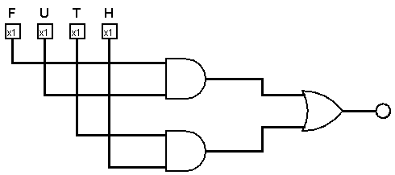
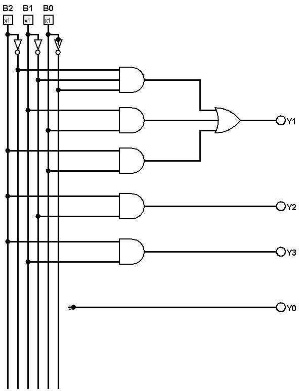

# Lista de Projeto 01 - Circuitos Digitais
Projeto direcionado à disciplina de Circuitos Digitais, ministrada pelo Prof Dr Pedro Thiago Valério de Souza no período 2025.2, na Universidade Federal Rural do Semi-Árido (UFERSA).

# Autores 
- Ana Beatriz Almeida da Silva | [Ana Beatriz Almeida](https://github.com/biiaalmeida) 
- Nome de Thiago | [Thiago Emanoel Evaristo Barroso Dantas](https://github.com/evaristoT)

# Sumário

- [Problema 01](#problema-01)
- [Problema 02](#problema-02)
- [Problema 03](#problema-03)
- [Problema 04](#problema-04)
- [Problema 05](#problema-05)

# Problema 01 
Implemente os seguintes circuitos com as expressões lógicas de saída dadas em Logisim, obtendo, como resposta, a tabela da verdade de cada circuito:  
## a) x = A'B + C
### Tabela Verdade da Expressão: 
| A | B | C | x |
|:-:|:-:|:-:|:-:|
| 0 | 0 | 0 | 0 |
| 0 | 0 | 1 | 1 |
| 0 | 1 | 0 | 1 |
| 0 | 1 | 1 | 1 |
| 1 | 0 | 0 | 0 |
| 1 | 0 | 1 | 1 |
| 1 | 1 | 0 | 0 |
| 1 | 1 | 1 | 1 |

## b) S = (A + B)(B + C')
### Tabela Verdade da Expressão: 
| A | B | C | S |
|:-:|:-:|:-:|:-:|
| 0 | 0 | 0 | 0 |
| 0 | 0 | 1 | 0 |
| 0 | 1 | 0 | 1 |
| 0 | 1 | 1 | 1 |
| 1 | 0 | 0 | 1 |
| 1 | 0 | 1 | 0 |
| 1 | 1 | 0 | 1 |
| 1 | 1 | 1 | 1 |

## c) x = ~(A B (C + D))
### Tabela Verdade da Expressão: 
| A | B | C | D | x |
|:-:|:-:|:-:|:-:|:-:|
| 0 | 0 | 0 | 0 | 1 |
| 0 | 0 | 0 | 1 | 1 |
| 0 | 0 | 1 | 0 | 1 |
| 0 | 0 | 1 | 1 | 1 |
| 0 | 1 | 0 | 0 | 1 |
| 0 | 1 | 0 | 1 | 1 |
| 0 | 1 | 1 | 0 | 1 |
| 0 | 1 | 1 | 1 | 1 |
| 1 | 0 | 0 | 0 | 1 |
| 1 | 0 | 0 | 1 | 1 |
| 1 | 0 | 1 | 0 | 1 |
| 1 | 0 | 1 | 1 | 1 |
| 1 | 1 | 0 | 0 | 1 |
| 1 | 1 | 0 | 1 | 0 |
| 1 | 1 | 1 | 0 | 0 |
| 1 | 1 | 1 | 1 | 0 |

## d) x = A ⊕ B ⊕ C
### Tabela Verdade da Expressão: 
| A | B | C | x |
|:-:|:-:|:-:|:-:|
| 0 | 0 | 0 | 0 |
| 0 | 0 | 1 | 1 |
| 0 | 1 | 0 | 1 |
| 0 | 1 | 1 | 0 |
| 1 | 0 | 0 | 1 |
| 1 | 0 | 1 | 0 |
| 1 | 1 | 0 | 0 |
| 1 | 1 | 1 | 1 |

## d) y = AB + BC + AC
### Tabela Verdade da Expressão: 
| A | B | C | y |
|:-:|:-:|:-:|:-:|
| 0 | 0 | 0 | 0 |
| 0 | 0 | 1 | 0 |
| 0 | 1 | 0 | 0 |
| 0 | 1 | 1 | 1 |
| 1 | 0 | 0 | 0 |
| 1 | 0 | 1 | 1 |
| 1 | 1 | 0 | 1 |
| 1 | 1 | 1 | 1 |

# Problema 02
Implemente os seguintes circuitos em Logisim, obtendo, como resposta, a expressão lógica simplificada e a tabela da verdade de cada circuito:  

## a) Circuito A
### Circuito dado na questão:  

### I) Expressão Lógica Simplificada: ABC  
### II) Tabela verdade: 

| A | B | C | x |
|:-:|:-:|:-:|:-:|
| 0 | 0 | 0 | 0 |
| 0 | 0 | 1 | 0 |
| 0 | 1 | 0 | 0 |
| 0 | 1 | 1 | 0 |
| 1 | 0 | 0 | 0 |
| 1 | 0 | 1 | 0 |
| 1 | 1 | 0 | 0 |
| 1 | 1 | 1 | 1 |

## b) Circuito B
### Circuito dado na questão:  

### I) Expressão Lógica Simplificada: B'C' + A'B'C  
### II) Tabela verdade: 

| A | B | C | D | x |
|:-:|:-:|:-:|:-:|:-:|
| 0 | 0 | 0 | 0 | 1 |
| 0 | 0 | 0 | 1 | 1 |
| 0 | 0 | 1 | 0 | 0 |
| 0 | 0 | 1 | 1 | 1 |
| 0 | 1 | 0 | 0 | 0 |
| 0 | 1 | 0 | 1 | 0 |
| 0 | 1 | 1 | 0 | 0 |
| 0 | 1 | 1 | 1 | 0 |
| 1 | 0 | 0 | 0 | 1 |
| 1 | 0 | 0 | 1 | 1 |
| 1 | 0 | 1 | 0 | 0 |
| 1 | 0 | 1 | 1 | 0 |
| 1 | 1 | 0 | 0 | 0 |
| 1 | 1 | 0 | 1 | 0 |
| 1 | 1 | 1 | 0 | 0 |
| 1 | 1 | 1 | 1 | 0 |

# Problema 03
Considere um circuito com tabela verdade apresentada abaixo. Utilizando o Logisim, obtenha a
expressão lógica simplificada para a saída Y e o diagrama de circuito correspondente.  

A questão nos dá a seguinte tabela da verdade:  
| A | B | C | D | Y |
|:-:|:-:|:-:|:-:|:-:|
| 0 | 0 | 0 | 0 | 1 |
| 0 | 0 | 0 | 1 | 1 |
| 0 | 0 | 1 | 0 | 1 |
| 0 | 0 | 1 | 1 | 1 |
| 0 | 1 | 0 | 0 | 0 |
| 0 | 1 | 0 | 1 | 0 |
| 0 | 1 | 1 | 0 | 0 |
| 0 | 1 | 1 | 1 | 0 |
| 1 | 0 | 0 | 0 | 1 |
| 1 | 0 | 0 | 1 | 0 |
| 1 | 0 | 1 | 0 | 1 |
| 1 | 0 | 1 | 1 | 0 |
| 1 | 1 | 0 | 0 | 0 |
| 1 | 1 | 0 | 1 | 0 |
| 1 | 1 | 1 | 0 | 1 |
| 1 | 1 | 1 | 1 | 0 |

### I) Expressão simplificada: 'A⋅B'+B'⋅D'+A⋅C⋅D'  
### II) Diagrama de circuito correspondente:  

# Problema 04

Um sistema de ar condicionado deverá atuar sob as seguintes premissas:

1.  Temperatura acima de 21°C **E** estar entre 9:00h e 17:00h, **OU**
2.  Ser final de semana **E** com umidade relativa do ar acima de 85%, **OU**
3.  Umidade relativa do ar acima de 85% **E** temperatura acima de 21°C **E** ser final de semana, **OU**
4.  Umidade relativa do ar acima de 85% **E** temperatura acima de 21°C **E** estar entre 9:00h e 17:00h.

Caso contrário, o sistema de ar condicionado deverá permanecer desligado.

### I. Variáveis de Entrada

Foram definidas as seguintes variáveis de entrada:

| Variável | Descrição | Complemento |
| :---: | :--- | :--- |
| **H** | Estar entre 9:00h e 17:00h | **H'** Não estar entre 9:00h e 17:00h |
| **U** | Umidade relativa do ar acima de 85% | **U'** Umidade relativa do ar abaixo de 85% |
| **T** | Temperatura acima de 21°C | **T'** Temperatura abaixo de 21°C |
| **F** | Final de semana | **F'** Dia da semana |

A expressão que modela as quatro premissas é: $$S = (T \cdot H) + (F \cdot U) + (U \cdot T \cdot F) + (U \cdot T \cdot H)$$

### II. Tabela Verdade
| F | U | T | H | S |
| :-: | :-: | :-: | :-: | :-: |
| 0 | 0 | 0 | 0 | 0 |
| 0 | 0 | 0 | 1 | 0 |
| 0 | 0 | 1 | 0 | 0 |
| 0 | 0 | 1 | 1 | **1** |
| 0 | 1 | 0 | 0 | 0 |
| 0 | 1 | 0 | 1 | **1** |
| 0 | 1 | 1 | 0 | 0 |
| 0 | 1 | 1 | 1 | **1** |
| 1 | 0 | 0 | 0 | 0 |
| 1 | 0 | 0 | 1 | 0 |
| 1 | 0 | 1 | 0 | **1** |
| 1 | 0 | 1 | 1 | **1** |
| 1 | 1 | 0 | 0 | 0 |
| 1 | 1 | 0 | 1 | **1** |
| 1 | 1 | 1 | 0 | **1** |
| 1 | 1 | 1 | 1 | **1** |

### III. Simplificação da Expressão (Mapa de Karnaugh)

### III. Simplificação da Expressão (Mapa de Karnaugh)

<table style="border-collapse: collapse; text-align:center;">
  <tr>
    <th style="border:1px solid black;">F, U / T, H</th>
    <th style="border:1px solid black;">00</th>
    <th style="border:1px solid black;">01</th>
    <th style="border:1px solid black;">11</th>
    <th style="border:1px solid black;">10</th>
  </tr>
  <tr>
    <th style="border:1px solid black;">00</th>
    <td style="border:1px solid black; color:blue;">0</td>
    <td style="border:1px solid black; color:blue;">0</td>
    <td style="border:1px solid black; color:blue;">0</td>
    <td style="border:1px solid black; color:blue;">0</td>
  </tr>
  <tr>
    <th style="border:1px solid black;">01</th>
    <td style="border:1px solid black; color:blue;">0</td>
    <td style="border:1px solid black; background-color:#d88; color:blue; font-weight:bold;">1</td>
    <td style="border:1px solid black; background-color:#d88; color:blue; font-weight:bold;">1</td>
    <td style="border:1px solid black; background-color:black; color:white;">0</td>
  </tr>
  <tr>
    <th style="border:1px solid black;">11</th>
    <td style="border:1px solid black; color:blue;">0</td>
    <td style="border:1px solid black; background-color:#d88; color:blue; font-weight:bold;">1</td>
    <td style="border:1px solid black; background-color:#f99; color:blue; font-weight:bold;">1</td>
    <td style="border:1px solid black; background-color:#f99; color:blue; font-weight:bold;">1</td>
  </tr>
  <tr>
    <th style="border:1px solid black;">10</th>
    <td style="border:1px solid black; color:blue;">0</td>
    <td style="border:1px solid black; color:blue;">0</td>
    <td style="border:1px solid black; background-color:#f99; color:blue; font-weight:bold;">1</td>
    <td style="border:1px solid black; background-color:#f99; color:blue; font-weight:bold;">1</td>
  </tr>
</table>

### IV. Expressão Lógica Simplificada e implementação do circuito lógico
#### a) Expressão Lógica Simplificada: 
$$S = TH + FU$$

#### b) Diagrama de circuito lógico
 

# Problema 05
Um circuito lógico combinacional calcula, a partir de uma entrada de 3 bits B (cada um dos bits
designados por B2, B1 e B0), a seguinte operação matemática:
$$Y = |2B − 3|$$

### I. Tabela verdade
| B2 | B1 | B0 | Y0 | Y1 | Y2 | Y3 |
| :-: | :-: | :-: | :-: | :-: | :-: | :-: |
| 0 | 0 | 0 | 1 | 1 | 0 | 0 |
| 0 | 0 | 1 | 1 | 0 | 0 | 0 |
| 0 | 1 | 0 | 1 | 0 | 0 | 0 |
| 0 | 1 | 1 | 1 | 1 | 0 | 0 |
| 1 | 0 | 0 | 1 | 0 | 1 | 0 |
| 1 | 0 | 1 | 1 | 1 | 1 | 0 |
| 1 | 1 | 0 | 1 | 0 | 0 | 1 |
| 1 | 1 | 1 | 1 | 1 | 0 | 1 |
### II. Expressões lógicas simplificadas para as saídas e o diagrama de circuito correspondente.

#### a) Expressões Lógicas Simplificadas: 
$$Y0 = 1$$
$$Y1 = B2'B1'B0 + B1B0 + B2B0$$
$$Y2 = B2B1'$$
$$Y3 = B2B1$$

#### b) Diagrama de circuito lógico

